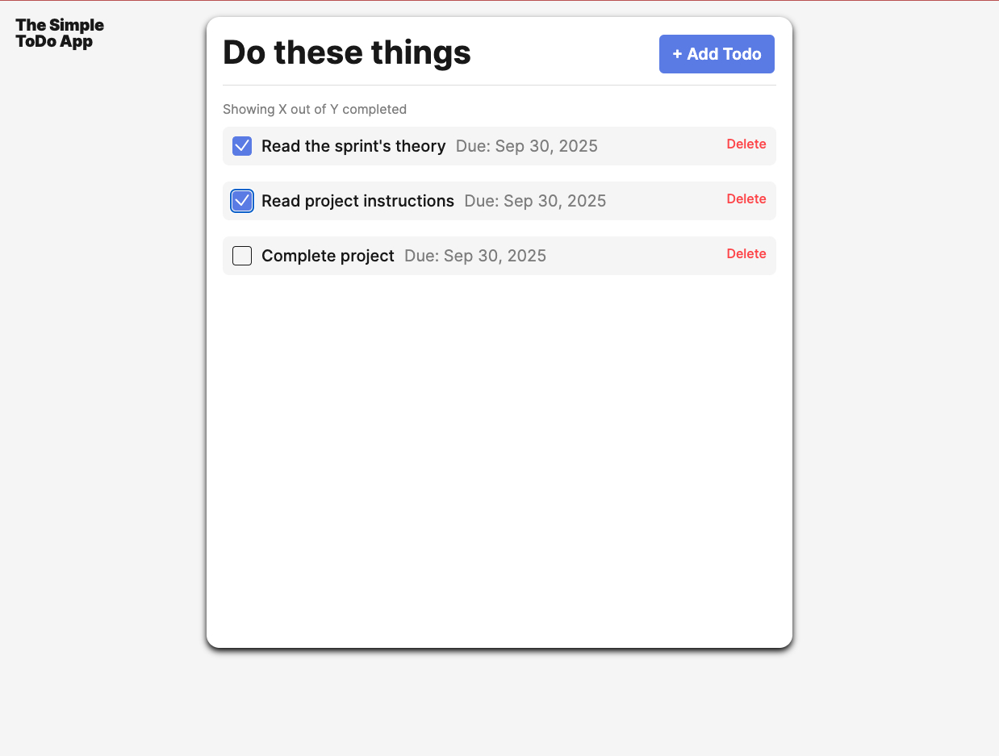

# 📝 Simple Todo App

A lightweight, browser-based **Todo application** built with JavaScript and organized using **object-oriented programming (OOP)** principles. This project demonstrates modular file structure, reusable components, and form validation.

## ✨ Functionality

- Add new todos with a **title** and optional **due date**.
- Mark todos as **completed** using a checkbox.
- Delete todos from the list.
- Form validation:

  - Invalid inputs display error messages.
  - Submit button is disabled until inputs are valid.

- Preloaded with a list of **initial todos**.
- Uses two main classes:

  - `Todo` → generates and manages todo items.
  - `FormValidator` → handles real-time form validation and resetting.

## 🛠️ Technology

- **JavaScript (ES6+)** for logic and OOP components.
- **HTML5 `<template>`** for generating todo items.
- **CSS3** for styling the UI.
- **UUID (via CDN)** for generating unique IDs for new todos.
- **Modular project structure**:

  ```
  se_project_todo-app/
  ├── components/
  │   ├── Todo.js
  │   └── FormValidator.js
  ├── pages/
  │   ├── index.js
  │   └── index.css
  ├── utils/
  │   └── constants.js
  ├── index.html
  └── README.md
  ```

📸 

## 🚀 Deployment

This project is deployed on GitHub Pages:

👉 [**Live Demo**](https://chrisdiaz98.github.io/se_project_todo-app/)
